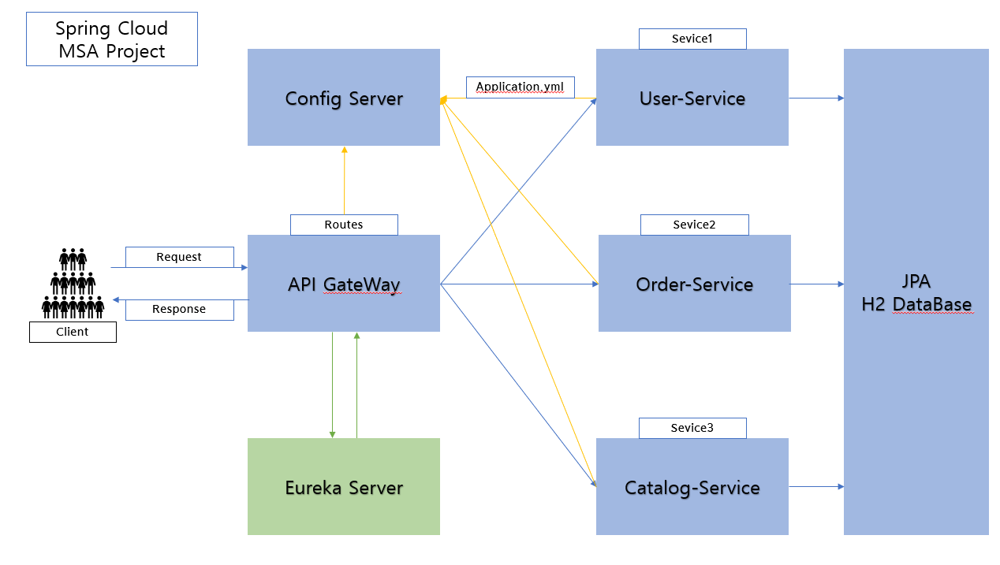
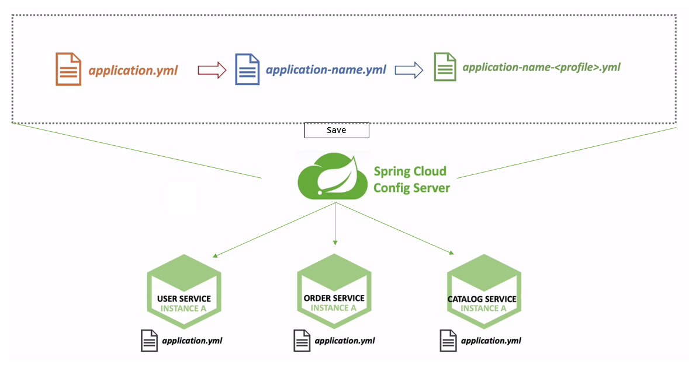

# MicroService-Project
Naver Blog = https://blog.naver.com/ses7361

Spring Cloud 를 이용한 MSA 아키텍쳐 형식 프로젝트
1. 구조

2. 서비스 별 기능 & 통합적인 기능

3. JWT login logic + login action url

4. Spring Cloud Config Server
   - Cloud Config Server를 이용한 MSA Service의 환경설정파일 외부화
    
5. 앞으로의 방향성
- Spring Cloud를 통한 Config 설정파일 application.yml 파일 외부에 저장
==> Builder를 하지않아도 실시간으로 설정내용 적용가능

