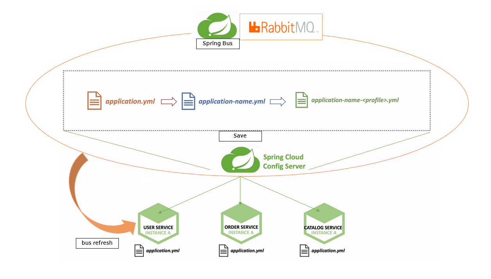

# MicroService-Project
Naver Blog = https://blog.naver.com/ses7361

Front End : X  
사용 도구 : IntelliJ , Postmen  
개발 환경 : Spring Boot , Spring Cloud , Spring Security , JPA(H2) , JWT등등 
           &nbsp;&nbsp;&nbsp;&nbsp;&nbsp;&nbsp;&nbsp;&nbsp;&nbsp;&nbsp;&nbsp;&nbsp;&nbsp;&nbsp;&nbsp;&nbsp;&nbsp;&nbsp;&nbsp;RabbitMQ

개발 목적 : Spring Cloud 를 이용하여 MicroService를 구현해보며,
Rest형식으로 다양한 기능을 구현하여 공부하는 목적

Spring Cloud 를 이용한 MSA 아키텍쳐 형식 프로젝트
1. 구조

2. 서비스 별 기능 & 통합적인 기능

3. JWT login logic + login action url

4. Spring Cloud Config Server
   - Cloud Config Server를 이용한 MSA Service의 환경설정파일 외부화
    
5. Spring Bus + RabbitMQ
   - SpringBus 와 RabbitMQ를 이용한 개별적 actuator->refresh 방식에서
    통합된 refresh방식으로 수정
     
5. 앞으로의 방향성
- Spring Cloud를 통한 Config 설정파일 application.yml 파일 외부에 저장
==> Builder를 하지않아도 실시간으로 설정내용 적용가능

